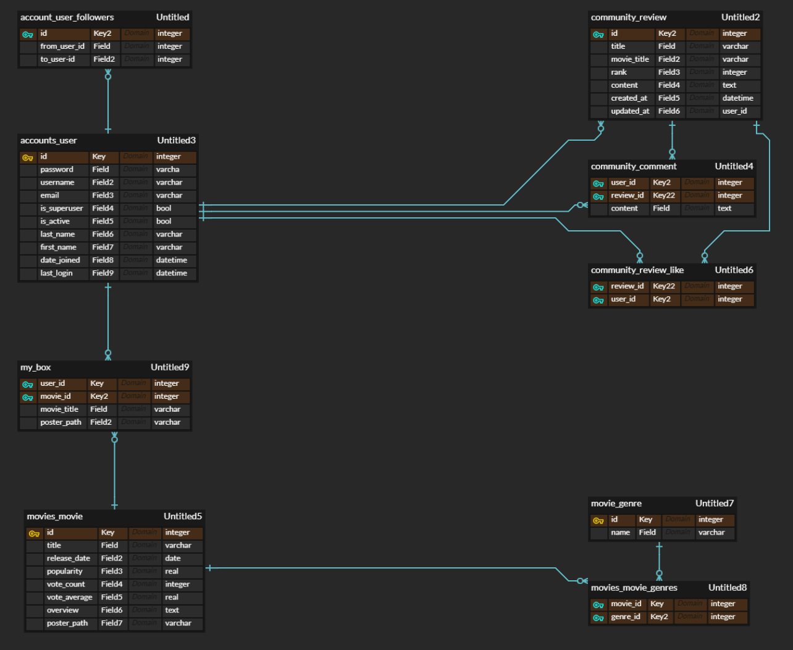
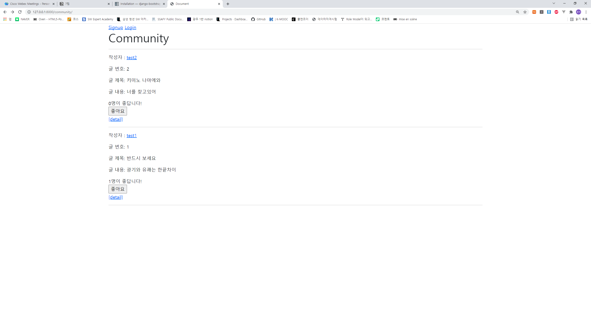
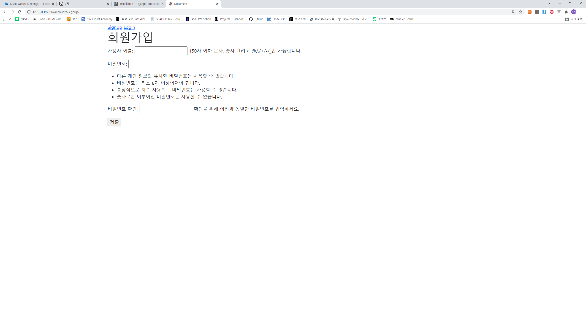
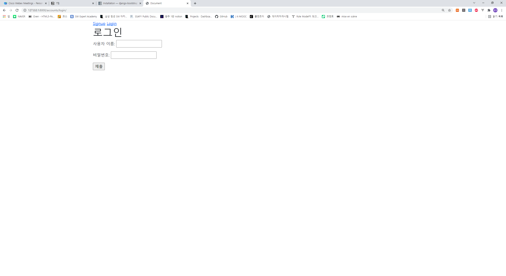
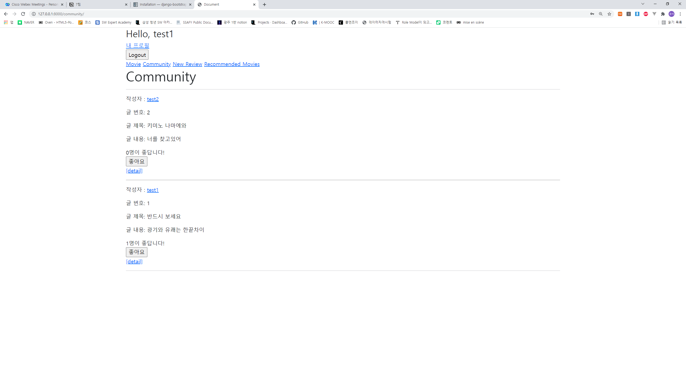
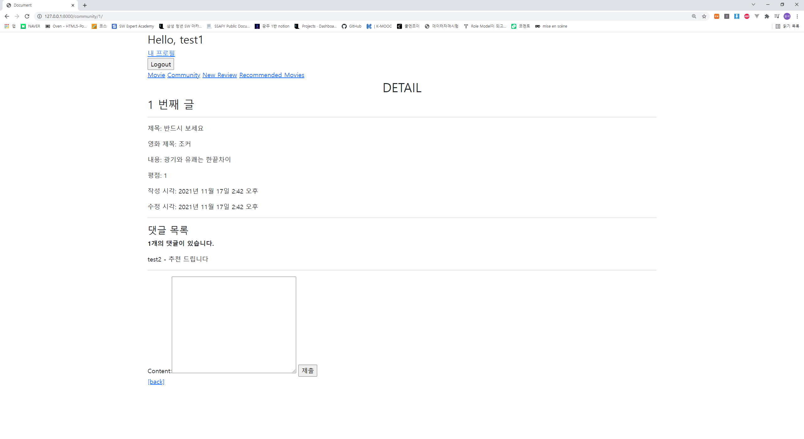
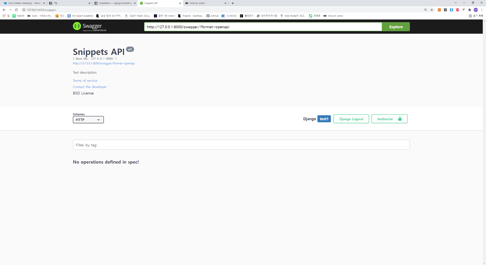
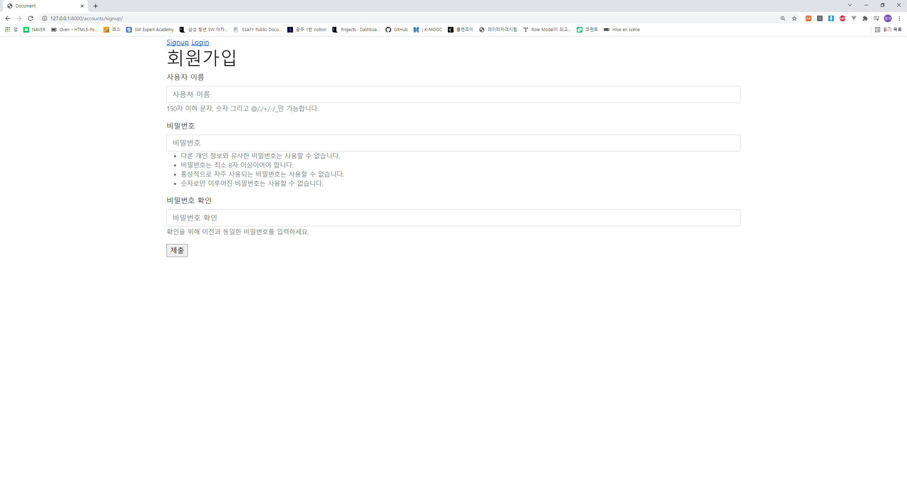
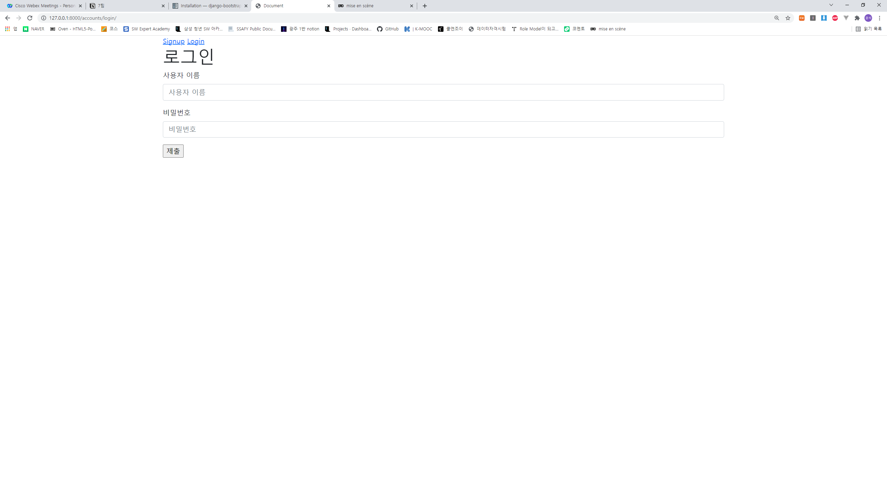

# README

기획 의도

프로젝트 관리, 개발 일지

회의록

스타일 가이드

Tech Stack

주요 기능 목록

UI & ERD

소감

## 11/16 ~ 17

1. 와이어 프레임 작성

2. ERD 작성

- 기본기능과 추가 기능(my box & review_like)에 대해 ERD 작성

3. Skeleton 코드 점검

- 기본 기능 구현 + 좋아요 기능이 적용된 django 프로젝트

4. api & extensions 적용

- url 문서 작성 (알아보기 쉽게 설명 + PPT & README 자료) 을 위해 Swagger api 적용

- bootstrap을 통해 css 작업을 할 예정 (bootstrap-django-v5 extensions을 로그인과 회원가입 폼에 적용시켜 테스트 완료)

