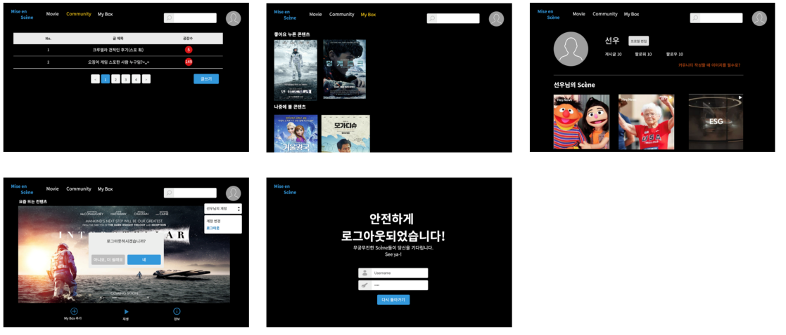

# 목차

1. [프로젝트 소개](#프로젝트-소개)

2. [팀원 소개 및 역할](#팀원-소개-및-역할)

3. [Tech Stack](#tech-stack)
4. [주요 기능 목록](#주요-기능-목록)
5. [ERD & UI](#erd--ui)
6. [마무리 소감](#마무리-소감)

# 프로젝트 소개🎬

> Mise en Scène: 무대에 모든 장면을 사전에 계획하여 밑그림을 그린다.
>
> 주제: Share Your Taste 당신의 취향저격 영화를 알려드립니다.

# 팀원 소개 및 역할😎

- **김채련**: HTML/CSS/JavaScripts, django, Bootstrap

- **손선우** : HTML/CSS/JavaScripts, django, Bootstrap, Social login, Payment, Search
- **최윤석** : HTML/CSS/JavaScripts, django, Bootstrap, TMDB API, Recommendation Algorithms

# Tech Stack💻

- **Frontend & Backend**

  

- **API**

  

# 주요 기능 목록

- 소설 로그인: 카카오, 네이버, 구글 

- 카카오 결제

- 영화 검색: 영화 제목, 줄거리 키워드 기반 검색

- 마음에 드는 영화 저장  

- 저장한 영화 장르 기반 추천: TMDB API 크롤링

  

# ERD & UI

- **ERD**

- **UI_Kakao oven**

# 마무리 소감

- **김채련** : 프로젝트를 진행하며 많이 배웠고, 앞으로 학습할 부분 또한 많다는 것을 깨달았습니다. 원격으로 협업하는 것에 대한 불안함이 컸지만 팀원분들 덕분에 많이 배울 수 있었습니다. 또한 협업의 장점과 시간을 투자하여 오류를 해결했을 때의 소소한 기쁨을 느낄 수 있는 시간이었습니다.

- **손선우** : 마지막까지 많은 배움을 얻어갔던 일주일이었다. 교수님께서 '이타적인 개발자'에 대해 강조하셨는데 크게 공감을 했다. 나 같은 경우도 user-friendly 뿐만 아니라 팀원들에게 보다 friendly한 사람이 되어야겠다고 다짐했다. 그 이유는 웹 상의 wireframe만 만들어 놓고 모바일 상, 즉 화면이 줄어들었을 때 어떤 식으로 레이아웃이 변해야 하는지를 기획하지 않았다. 이러한 이슈를 프로젝트 마지막 날에 알아서 급하게 반응형으로 바꾸긴 했지만, 사전에 계획하고 움직였다면 더 좋았을 것 같다는 생각이 들었다. 채련님과 윤석님 덕분에 열정을 계속 이어나갈 수 있었다. Mise-en-Scène 최고!

- **최윤석** : Mise en scene 프로젝트는 여태까지 ssafy를 하면서 가장 값진 경험이었다. 10주간 관통 프로젝트를 통해 만들어온 영화 커뮤니티를 기반으로 했지만, 정해진 틀에서 벗어나 새로운 웹페이지로 만들고, 알고리즘을 도입하며 다양한 라이브러리와 api를 사용해 볼 수 있었다. 2주라는 기획을 포함한 개발기간은 아직 미숙한 나와 팀원들에게 조금 짧다 느껴졌지만, 그만큼 데드라인에 대한 긴장감을 가지고 서로 으쌰으쌰하며 최선을 다해 임했던 것 같다. 기획 단계에서 우리의 영화 추천 알고리즘을 생각하고, my box페이지와 소셜 로그인을 핵심 추가 기능으로 잡으며 그에 어울리는 팀명인 미장센을 생각했을 땐 정말 뿌듯했다. 개발중 벽에 막힐때마다 서로 힘들고 고통받았지만, 팀원들과 함께, 또 반 친구들과 교수님 덕에 한단계씩 해결해 나가며 그만큼 보람있고 재미있었다. 데드라인이 다가오고 개발 완성단계가 다가올 수록 모자란 부분, 아쉬운 부분들이 눈에 띄면서 초반의 여유있던 개발 태도와 엉성한 기획을 후회하기도 했지만 그러면서도 임시방편으로 메운 추가 부분들이 생각보다 마음에 들기도 했다. 한가지 확실한 것은 이 경험이 나와 우리 팀원들이 개발자로서 성장하는데 큰 도움을 줄 것이란 사실이다. 이번 미장센을 발판으로 삼아 미래의 우리 팀원들이 개발자들의 무대위에 한 자리를 차지할 것이라 믿는다.

  

